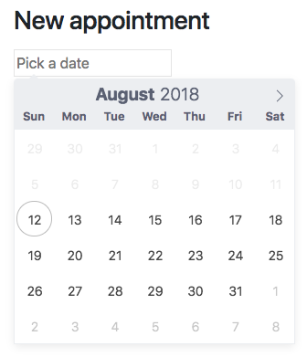
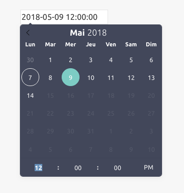
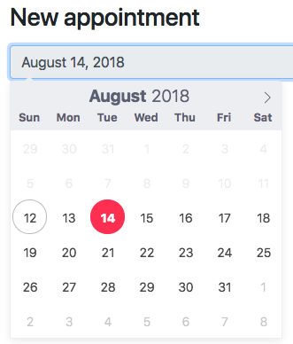
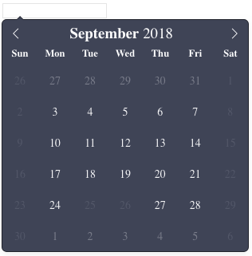

<h1 align="center">📆 Stimulus-Flatpickr Wrapper</h1>
<p align="center">
  <a href="https://www.npmjs.com/package/stimulus-flatpickr" rel="nofollow">
    
  </a>
  <a href="https://circleci.com/gh/adrienpoly/stimulus-flatpickr" rel="nofollow">	
    	
  </a>	
  <a href="https://codecov.io/gh/adrienpoly/stimulus-flatpickr">	
    	
  </a>
</p>

<p align="center">
  <b>Modest yet powerful wrapper of Flatpickr for Stimulus</b></br>
  <sub>Only ~1kb <sub>
</p>

<br />

- **Simple**: create advanced datepickers with less code
- **Backend Friendly**: easily pass backend information to the datepicker (locals, availabilities, date formats etc)
- **strftime friendly**: [converts automatically strftime](#date-and-time-formats) formats to flatpickr formating tokens
- **Disable days of week**: easily disable days of week (ie: all sundays)
- **Turbolinks**: make all your datepickers compatible with Turbolinks by design
- **Getters**: all Flatpickr elements are available as [targets](#elements)
- **Events/hooks**: all flatpickr [events/hooks](#callbacks) are directly available in your Stimulus Controller.
- **Example**: [detailed example](#example) for adavanced usage of flatpickr
- **MIT Licensed**: free for personal and commercial use

## A modest wrapper of Flatpickr for Stimulus

By using this wrapper of [Flatpickr](http://flatpickr.js.org/) for [Stimulus](https://stimulusjs.org/) you can make all configurations for the Datepicker directly with the `data-attributes` of the HTML. This makes it very handy to create datepicker with server generate html and pass information from the backend to the datepicker.

Here is a simple example:

```erb
<%= form_with model: Appointement.new, authenticity_token: true do |f| %>
  <%= f.text_field :start_time,
    data: {
      controller: "flatpickr",
      flatpickr_min_date: Time.zone.now #disables past dates
    } %>
<% end %>
```

<p align="center">
  👇👇👇👇👇👇
</p>
<p align="center">
  
</p>

## Example

An example of a Rails app showcasing

- localization of the datepicker 🌍
- localization of the date formats 🌍
- availabilities in the date picker 📅
- Fully boosted with Turbolinks 🚀

is available here : [Rails Stimulus Flatpickr](https://github.com/adrienpoly/rails_stimulus_flatpickr)

## Install

This assumes that you have [Stimulus](https://stimulusjs.org/handbook/installing) already installed. For Rails(5.1+) app please refer this doc (https://github.com/rails/webpacker/blob/master/docs/integrations.md#stimulus) to get started with Stimulus.

In your project just add the `flatpickr` and `stimulus-flatpickr` package.

```bash
$ yarn add flatpickr
$ yarn add stimulus-flatpickr
```
or

```bash
$ npm i flatpickr
$ npm i stimulus-flatpickr 
```
Note: Do not use both `yarn` and `npm` to install packages, this might lead to an error: `...It is advised not to mix package managers in order to avoid resolution inconsistencies caused by unsynchronized lock files`

## Basic usage

If you only need to convert an input field in a DateTime picker, you just need to register a standard Stimulus controller and add some markup to your input field.

### Register a Flatpickr Controller

manually register a new Stimulus controller in your main JS entry point.

```js
// ./packs/application.js
import { Application } from 'stimulus'
import { definitionsFromContext } from 'stimulus/webpack-helpers'

const application = Application.start()
const context = require.context('../controllers', true, /\.js$/)
application.load(definitionsFromContext(context))

// import Flatpickr
import Flatpickr from 'stimulus-flatpickr'

// Import style for flatpickr
require("flatpickr/dist/flatpickr.css")

// Manually register Flatpickr as a stimulus controller
application.register('flatpickr', Flatpickr)
```
Note: 
* **Setup**: By Manually registering Flatpickr controller, you don't need to create a `flatpickr_controller.js` file. However, To add custom behavior you will have to create the `flatpickr_controller.js` file. Read more details about it below.
* **Style**: You can always choose different theme for calender by requiring different `.css` file. You can find them inside your app's root directory `node_modules/flatpickr/dist/themes`
* **Deployment**: In Production environment, include `<%= stylesheet_pack_tag 'application', media: 'all', 'data-turbolinks-track': 'reload' %>` in your `application.html.erb` file in order to load the calendar style.


### Using it with Rails

You can now create forms and input fields easily by adding a `data-controller="flatpickr"` attribute to the input fields and pass [options](https://flatpickr.js.org/options/) with the Stimulus Controller states : `data-flatpickr-the-option`.

```erb
<%= form_with model: Appointement.new, authenticity_token: true do |f| %>
  <%= f.text_field :start_time,
    data: {
      controller: "flatpickr",
      flatpickr_date_format: "Y-m-d",
      flatpickr_min_date: Time.zone.now
    } %>
<% end %>
```

<p align="center">
  👇👇👇👇👇👇
</p>
<p align="center">
  
</p>

### Options & conventions

All options for Flatpickr can be found [here](https://flatpickr.js.org/options/).

All options are in `camelCase` (JS) and must be converted to `lower_snake_case` in the `data-attribute`. `lower_snake_case` is automatically converted to `kebab-case` when rails render the HTML.

```erb
<%= f.text_field :start_time,
  data: {
    controller: "flatpickr",
    flatpickr_enable_time: true
  }
} %>
```

will output this HTML:

```html
<input data-controller="flatpickr" data-flatpickr-enable-time="true" type="text" name="appointement[start_time]" />
```

### HTML markup

If you are not using Rails or simply wants to markup your HTML directly, simply add a `html data-controller="flatpickr"` to your input field and some options `html data-flatpickr-some-option="value"` options must be converted from `camelCase` to `kebab-case`

## Advanced Usage

If you need more than just displaying the standard DateTime picker, then you can extend the `stimulus-flatpickr` wrapper controller. This is necessary when you need to:

- set a custom language
- create custom callbacks
- perform JS business logic

**Skip basics installation steps from above!**

### Extends the controller

create a new Stimulus controller that will inherit from `stimulus-flatpickr`

```js
// ./controllers/flatpickr_controller.js
// import stimulus-flatpickr wrapper controller to extend it
import Flatpickr from 'stimulus-flatpickr'

// you can also import a translation file
import { French } from 'flatpickr/dist/l10n/fr.js'

// import a theme (could be in your main CSS entry too...)
import 'flatpickr/dist/themes/dark.css'

// create a new Stimulus controller by extending stimulus-flatpickr wrapper controller
export default class extends Flatpickr {
  initialize() {
    // sets your language (you can also set some global setting for all time pickers)
    this.config = {
      locale: French
    }
  }

  // all flatpickr hooks are available as callbacks in your Stimulus controller
  change(selectedDates, dateStr, instance) {
    console.log('the callback returns the selected dates', selectedDates)
    console.log('but returns it also as a string', dateStr)
    console.log('and the flatpickr instance', instance)
  }
}
```

### Global settings for all datepickers

As we have seen just above you can easily from your rails `erb` code pass the flatpickr options. This is great for passing dynamic options that might change (ie enableDate, dateFormat etc).

If all your datepickers share some global settings you can define them in your `initialize()` or `connect()` function.

```js
initialize() {
   //global options
    this.config = {
      enableTime: true,
      time_24hr: true
    };
  }
```

or with `connect()`

```js
connect() {
   //global options
    this.config = {
      ...this.config, //spread options in case some where defined in initialize
      enableTime: true,
      time_24hr: true
    };

    //always call super.connect()
    super.connect();
  }
```

### HTML markup

Then in the same way as above you can now create forms and input fields easily by adding a `data-controller="flatpickr"` attribute to the input fields and pass [options](https://flatpickr.js.org/options/) with the Stimulus Controller states : `data-flatpick-the-option`.

```erb
<%= form_with model: Appointement.new, authenticity_token: true do |f| %>
  <%= f.text_field :start_time,
                    data: {
                      controller: "flatpickr",
                      flatpickr_date_format: "Y-m-d",
                      flatpickr_min_date: Time.zone.now }
  %>
  <% end %>
```

<p align="center">
  👇👇👇👇👇👇
</p>
<p align="center">
  
</p>

### Date and Time formats

Flatpickr has custom [formatting tokens](https://flatpickr.js.org/formatting/). in Rails (and other backends) formats are based on `strftime` standard.

This package automatically converts `strftime` datetime formats to the nearest Flatpickr format.

With this solution, it becomes handy to localize your date formats. `t("date.formats.long")` outputs `"%B %d, %Y"`for the local `:en` and it outputs `"%e %B %Y"` for the locale `:fr`.

```erb
<%= form_with model: appointment do |f| %>
  <%= f.text_field :start_at,
      data: {
        controller: "flatpickr",
        flatpickr_alt_format: t("date.formats.long"),
        flatpickr_alt_input: true,
        flatpickr_min_date: Time.zone.now,
      } %>
<% end %>
```

<p align="center">
  👇👇👇👇👇👇
</p>
<p align="center">
  
</p>

### Enable/Disable days of week

With Flatpickr to disable certain days of the week, you need to use the disable js function. Obviously passing a function through data-attributes is not easy 😄.

The wrapper introduce two new configuration options:

- `disableDaysOfWeek`: pass an array of days to disable (all others are enabled)
- `enableDaysOfWeek`: pass an array of days to enable (all others are disabled)

<table>
<th>
Code
</th>
<th>
Result
</th>
<tr>
<td>
   <pre lang="erb">
   <%= form_with model: Appointement.new, authenticity_token: true do |f| %>
     <%= f.text_field :start_time,
       data: {
         controller: "flatpickr",
         flatpickr_disable_days_of_week: [5,6], #disables saturdays and sundays
         flatpickr_disable: ["2018-09-25", "2018-09-26"] #disables individual dates
       } %>
   <% end %>
   </pre>
</td>
<td>
  <p align="center">
    
  </p>
</td>
</tr>
</table>

### Callbacks

All Flatpickr [events/hooks](https://flatpickr.js.org/events/) are available as callbacks in the extended controller as demonstrated above for the `onChange` hook.

Just add the function to your Stimulus Controller in `camelCase` without `on`.

`onChange` -> `change(){}`

### Instance and its methods

You can access the flatpickr instance from your Stimulus controller by calling `this.fp`. Also, the instance methods are available through this instance call.

```javascript
yourFunction () {
  // ...
  this.fp.clear()
  this.fp.close()
}
```

### Custom elements

If you need to wrap the Flatpickr controller arround custom elements you can use the predefined target `instance` to specify the input element to attach the date picker to.

Example:

```html
<div data-controller="flatpickr">
  <input type="text" placeholder="Select Date.." data-target="flatpickr.instance" />
</div>
```

### Getters

#### Elements

In your controller you can access the Flapickr [elements](https://flatpickr.js.org/instance-methods-properties-elements/#elements) using some Stimulus like targets.

`this.calendarContainerTarget` : Self-explanatory. This is the div.flatpickr-calendar element.

`this.currentYearElementTarget`: The input holding the current year.

`this.daysTarget` : The container for all the day elements.

`this.daysContainerTarget` : The container for all the day elements.

`this.inputTarget` : The text input element associated with flatpickr.

`this.nextMonthNavTarget` : The “right arrow” element responsible for incrementing the current month.

`this.monthNavTarget` : The container with the month navigation.

`this.prevMonthNavTarget` : The “left arrow” element responsible for decrementing the current month.

`this.selectedDateElemTarget`: the selected date element.

`this.todayDateElemTarget`: today element.

`this.weekdayContainerTarget`: the container we all the days of the week.

## Overriding connect & disconnect

if you need to override the connect function in the extended controller, you need to call `super`

```js
connect(){
  // ...
  // define global settings as explained in the global settings section before super
  // ...

  // always call super.connect()
  super.connect();

  // ...
  // Your code can access this.fp flatpickr instance
  // ...
}
```

## Internationalization

To handle multiple language to translate your datepicker and convert the date formats, you can have a look at the [example app](https://github.com/adrienpoly/rails_stimulus_flatpickr). `stimulus-flatpickr` makes it straight forward to handle locales.

## CSS

This wrapper does not include any CSS. Flatpickr CSS should be loaded separately from the main Flatpickr package as you would normally do.

## Contributing

Bug reports and pull requests are welcome.

**To contribute:**

Fork the project.

Install dependencies

`$ yarn install`

Start the test watcher

`$ yarn test:watch`

Running one-off test runs can be done with:

`$ yarn test`

You can test locally also the results with the playground project [./playground](./playground)

`$ yarn start:playground`

**Then :**

👍 Write some tests

💪 Add your feature

🚀 Send a PR

## License

This package is available as open source under the terms of the MIT License.
